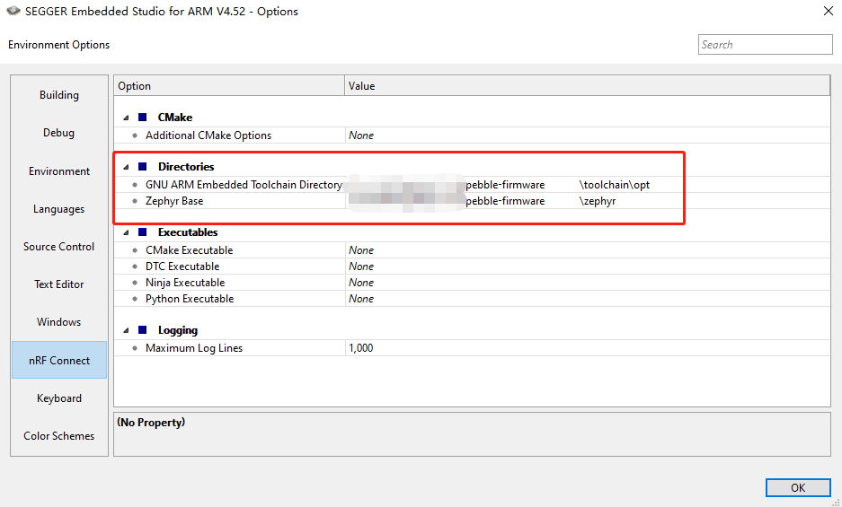
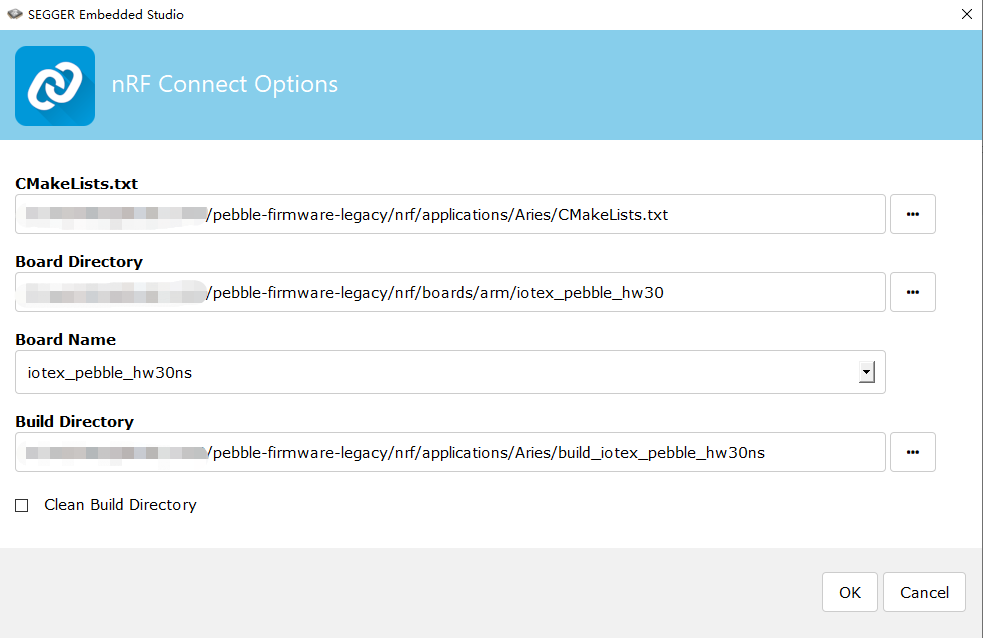
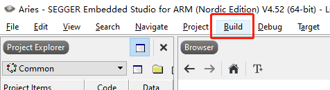
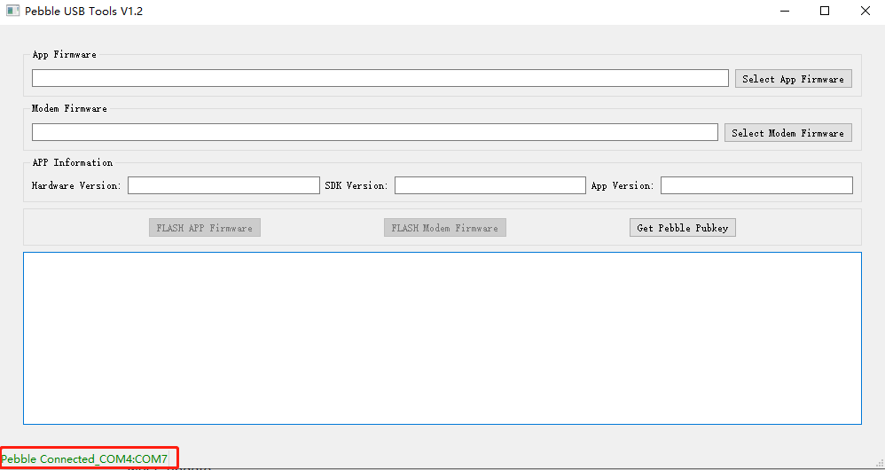
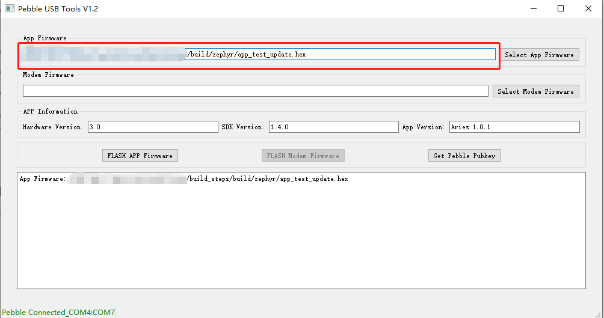
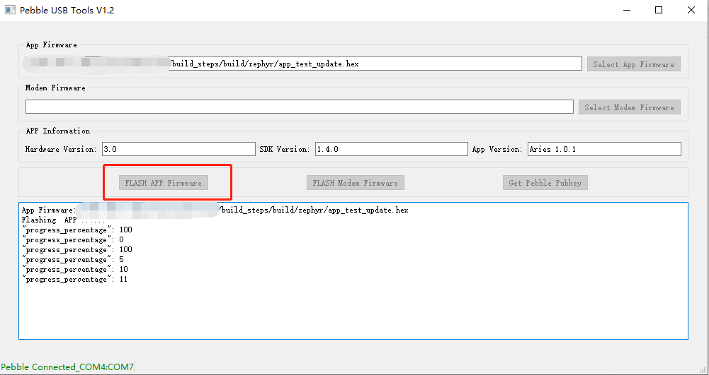

# Download source code
## Clone sdk
```
cd   ~    
git clone --recursive https://github.com/iotexproject/pebble-firmware.git
```
## Clone app
### Clone aries

```
cd   ~/pebble-firmware/nrf/applications
git   clone -b aries https://github.com/iotexproject/pebble-apps.git
mv   pebble-firmware/nrf/applications/Aries.
rm   -rf   pebble-apps
```

### Clone riverrock

```
cd   ~/pebble-firmware/nrf/applications
git   clone -b riverrock https://github.com/iotexproject/pebble-apps.git
mv   pebble-firmware/nrf/applications/Riverrock  .
rm   -rf   pebble-apps
```
# Compile Firmware
## Build on Windows
### Prepare
#### Donwload and Install Embedded Studio IDE
https://www.segger.com/downloads/embedded-studio/EmbeddedStudio_ARM_Nordic_v452_win_x64.zip
#### Download and Install GNU ARM Embedded Toolchain
Please refer to here to install : https://docs.iotex.io/machinefi/web3-devices/pebble-tracker/firmware-development/develop-and-build-the-firmware/build-on-windows
### Configure  Embedded Studio IDE
#### Configure zephyr directory and  toolchain

- Choose Options under the Tools menu
- Choose nRF Connect on the left side of the "Option" window
- Locate Directories section and configure "GNU ARM Embedded Toolchain Directory" and "Zephyr Base" to the corresponding directories, respectively (see the image):
  

### Build
#### Create project

In the Embedded Studio IDE and choose Open nRF Connect SDK Project... under the File menu and configure the paths of CMakeLists.txt and Board Directory, also set Board Name to iotex_pebble_hw30ns, as shown in the image below (please adapt to your Windows user path):
  

#### Build in Embedded Studio IDE

Choose Build Solution from the Build menu to build the firmware: check out the output panel for the compilation output and wait until the end of the compilation process.
  

At the end of the build process you will find the new Pebble firmware file at:
~/pebble-firmware\nrf\applications\Aries\build_iotex_pebble_hw30ns\zephyr\app_test_update.hex
## Build on Linux/macOS
### Prepare
#### Install-dependencies
```
cmake --version # must be >= 3.13.1
dtc --version # must be >= 1.4.6
python --version # bust be >= 3.6
```
#### Install required python dependencies
```
cd  ~/pebble-firmware
pip3 install -r zephyr/scripts/requirements.txt
pip3 install -r nrf/scripts/requirements.txt
pip3 install -r bootloader/mcuboot/scripts/requirements.txt
```
#### Install arm-compiler-toolchain
```
cd ~
wget   https://armkeil.blob.core.windows.net/developer/Files/downloads/gnu-rm/9-2020q2/gcc-arm-none-eabi-9-2020-q2-update-x86_64-linux.tar.bz2
tar  -jxvf gcc-arm-none-eabi-9-2020-q2-update-x86_64-linux.tar.bz2
mv  gcc-arm-none-eabi-9-2020-q2-update gnuarmemb
echo 'export ZEPHYR_TOOLCHAIN_VARIANT=gnuarmemb' >> ~/.zephyrrc
echo 'export GNUARMEMB_TOOLCHAIN_PATH="~/gnuarmemb"' >> ~/.zephyrrc
```
#### Install west 
```
pip3 install --user -U west
echo 'export PATH=~/.local/bin:"$PATH"' >> ~/.bashrc
source ~/.bashrc
west --version
```
### Build
```
cd ~
source   pebble-firmware/zephyr/zephyr-env.sh
rm   -rf   build/
west  update 
west   zephyr-export
west  build   -b   iotex_pebble_hw30ns   ./pebble-firmware/nrf/applications/Aries
```

## Build with vscode
Please refer to the following instructions:

[nRF Connect for VSCode](https://www.nordicsemi.com/Products/Development-tools/nRF-Connect-for-VS-Code/Tutorials)

[vscode nrf-connect get started](https://nrfconnect.github.io/vscode-nrf-connect/get_started/build_app_ncs.html)

# Load Firmware
## Install tools
### MacOS
- Download and install the latest [VCP Drivers](https://www.silabs.com/developers/usb-to-uart-bridge-vcp-drivers) for macOS
- Download, unzip and run the executable file: [PebbleUSBTool](https://drive.google.com/file/d/1p5aQajwehvYWe1NWelWFaJCl45mMmeqJ/view?usp=sharing)
### Windows
- Download and install the latest [VCP Driver](https://www.silabs.com/developers/usb-to-uart-bridge-vcp-drivers) for Windows
- Download and install the latest [J-link software](https://www.segger.com/downloads/jlink/) for Windows
- Unzip and run the executable file: [PebbleUSBTools.exe](https://drive.google.com/file/d/1exM9L_21qNQYAc92MdgKeXYK5ZHX3v3L/view?usp=sharing)
### Ubuntu
- Download and unzip [PebbleUSBTools](https://drive.google.com/file/d/1Ulcr7B6fYI5FH_HJn71nHgDD7Yer6evR/view?usp=sharing)
- Enter the PebbleUSBTool folder
- Install pebble-udev_1.0.1-all.deb
- chmod +777 PebbleUSBTools
- Reboot your system
- Inside the PebbleUSBTool folder run ./PebbleUSBTools
## Burn firmware with PebbleUSBTools

  1. Open PebbleUSBTools.exe and make sure  the pebble usb is connected
       
  2. Click "Select App Firmware" button to select the firmware to be burned
        
  3. Restart Pebble in Firmware update mode
Make sure your Pebble battery is charged. Press and keep pressing the Confirm/Power button, then use a pin or a SIM card tool to press the hardware reset button (while you keep pressing the Power button).
The Pebble should now boot in firmware update mode, with the status led of red color and always on: you can release the Power button.
  4. Flash the Firmware
         Click the “Flash APP Firmware” button:
        
     Wait for the firmware upgrade to complete. The device will reboot automatically after the 
     operation is completed, and the new firmware will be loaded.