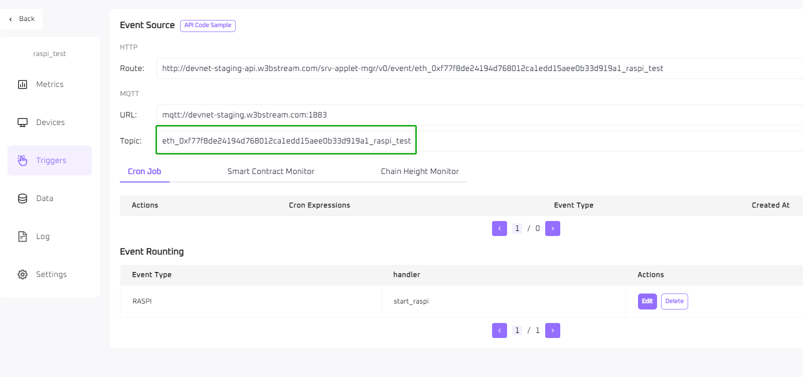
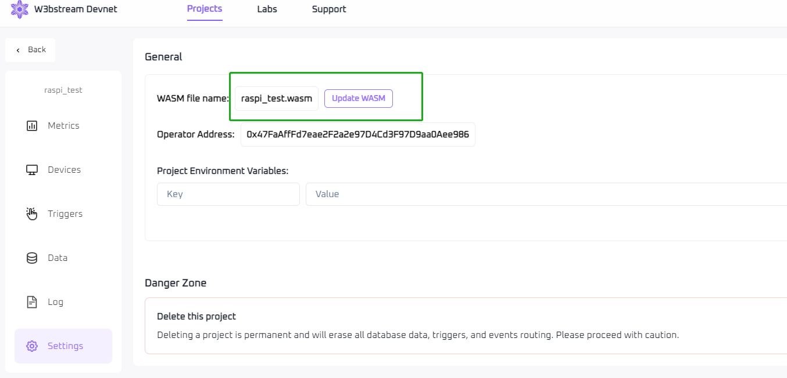
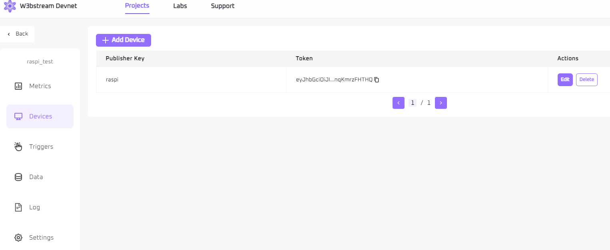
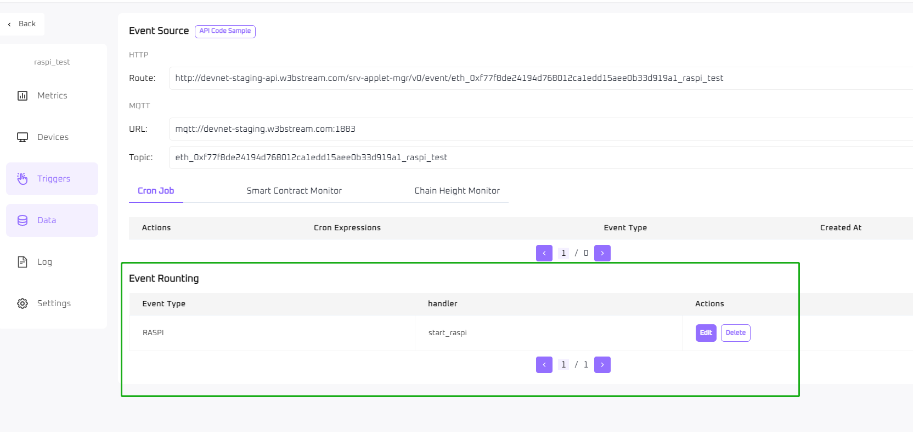
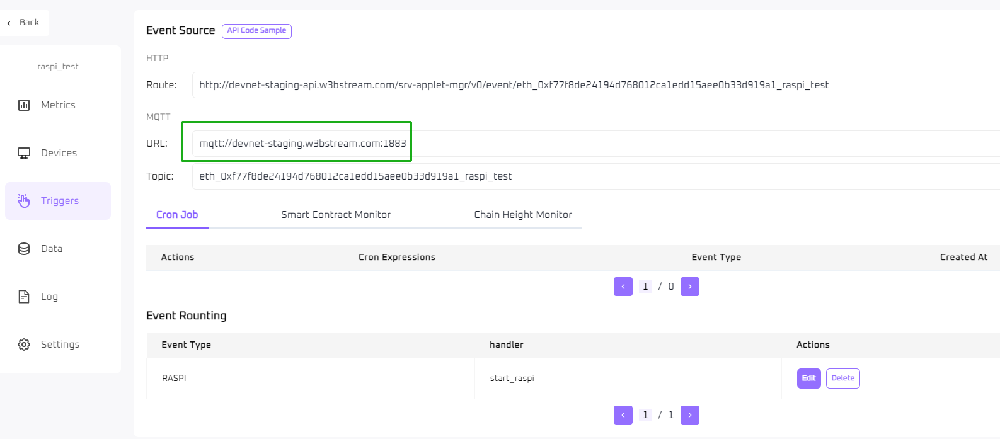
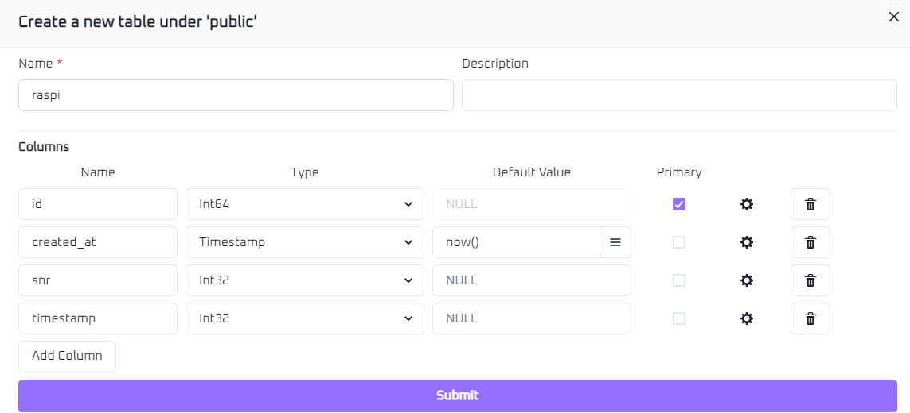
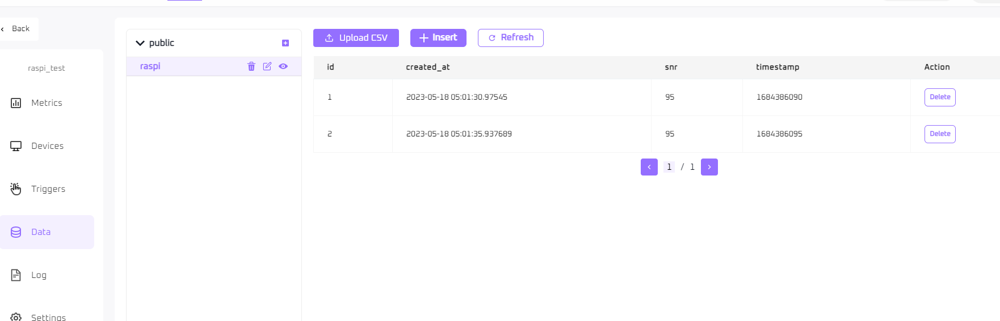

# Raspberry Pi Connection devnet Example

This example demonstrates how the Raspberry Pi connects to devnet, signs and uploads data.

## Requirements

Ensure your system meets the following requirements before building and runnning the program.  


### Raspberry Pi

  Hardware: Raspberry Pi 4 Model B Rev 1.4

  OS: Raspbian GNU/Linux 10 (buster)

### Mosquitto

The Mosquitto library is required to establish communication between the device and the server.  

Run the following command to install Mosquitto on Raspberry Pi: 

```bash
apt-get install mosquitto
# Make sure the protoc version is v3.6.0+
apt-get install protobuf-compiler
pip install protobuf grpcio-tools
# Check the protoc version after installation
protoc  --version

```  


### Build toolchain

CMake along with gcc or clang is used to build the SDK and examples.

Run the following command to install the required build toolchain on Raspberry Pi or debian based systems:

```bash
apt-get install cmake build-essential
```  

### Configuration source code

  1. Run the following command to clone the repository:

      ```bash
      git clone https://github.com/machinefi/web3-iot-sdk.git

      ```
  2. Compile wasm
     
     First you need to install the rust development environment, you can refer to [here](https://datawithrust.com/chapter_2/chapter_2_1.html).

     ```bash
      rustup target add  wasm32-wasi
      cd  examples/w3bstream-client-rpi-mqtt/tools/wasm/raspi_test/
      make

     ```
     The raspi_test.wasm file will be generated in the w3bstream-client-rpi-mqtt/tools/wasm/raspi_test/target/wasm32-wasi/release directory after compilation.

  3. Create a project in w3bstream devenet

     You can create a project in [w3bstream devnet](https://devnet-staging.w3bstream.com) called "raspi_test" (or any other name). Get topic from w3bstream trigger tab (in the green marker box) as runtime parameter.

      

  4. Upload  wasm file

     Click "Create Instance" to upload the "dev_test.wasm" file(in the green marker box) generated in step 2.
     


  5. Create device

     Add a device in w3bstream devnet Devices tab, and copy token as runtime parameter.

     
  
  6. Edit Event Routing
  
     Create "Event Routing"  in the w3bstream devnet "Triggers" page like this (in the green marker box):
     Event Type:  RASPI
     handler:  start_raspi
     

  7. Configure mqtt host and port
     
     Get mqtt host and port from w3bstream trigger tab(in the green marker box).
     

     Configure the mqtt broker host and port in examples/w3bstream-client-rpi-mqtt/main.cpp. 

     eg.

     ```C++
     const std::string broker_address = "devnet-staging.w3bstream.com";
	  const int broker_port = 1883;
     ```
  8. Configuration database

    Create a new table named "raspi" and add two columns named snr and timestamp to the w3bstream devnet data tab and select integer as the data type.

    The page looks like this after the table is created.
   


## Building this example

Change directory to the repository root folder:

```bash
cd web3-iot-sdk
```

Run the cmake configure command and enable the `DBUILD_EXAMPLE_WEBSTREAM_RPI_MQTT` and `GIT_SUBMODULE_UPDATE` options. Enabling `GIT_SUBMODULE_UPDATE` ensures the the dependencies are downloaded:

```bash
cmake -DBUILD_EXAMPLE_WEBSTREAM_RPI_MQTT=ON -DGIT_SUBMODULE_UPDATE=ON -S ./ -B ./build-out
cmake --build build-out --target w3bstream-client-rpi-mqtt
```

If everything went correctly, you should see a something along the lines of:

```bash
[100%] Built target w3bstream-client-rpi-mqtt
```

The build output will be placed inside the `build-out` directory.

## Add public key to wasm

### Generate key

```bash
cd web3-iot-sdk/build-out/examples/w3bstream-client-rpi-mqtt

./w3bstream-client-rpi-mqtt  -t w3bstream_token  -T w3bstream_topic

```
The public.key file is now generated in the web3-iot-sdk/build-out/examples/w3bstream-client-rpi-mqtt directory.

### Copy the public key to wasm
Convert public.key to a hexadecimal string.

```bash
cd web3-iot-sdk/build-out/examples/w3bstream-client-rpi-mqtt

hexdump -e '16/1 "%02X"' public.key
```

Copy public key(hex string) to the "raspi_pub_key" variable in the dev_test/src/lib.rs file. Recompile dev_test and upload the raspi_test.wasm file in the w3bstream devnet settings tab. 

## Running this example

Change directory to `build-out`:

```bash
cd web3-iot-sdk/build-out/examples/w3bstream-client-rpi-mqtt

./example-w3bstream-client-rpi-mqtt  -t w3bstream_token  -T w3bstream_topic

Connecting to the broker at devnet-staging.w3bstream.com ...
Successfully connnected to the MQTT broker.
Data to be signed :
00 00 00 00 08 5f 10 cc 02 18 80 d0 ac f3 0e 20 80 d0 ac f3 0e 28 f9 2f 30 b4 1b 38 a2 cd 01 40 a3 23 48 f3 0f 50 b4 1b 5a 04 c3 29 12 16 62 06 c4 29 f6 3b fc 33 6a 10 37 61 65 36 33 39 63 35 36 30 35 63 37 63 65 64 64 74 8d d5
....

```
Now you can see the uploaded data in the w3bstream data tab.


